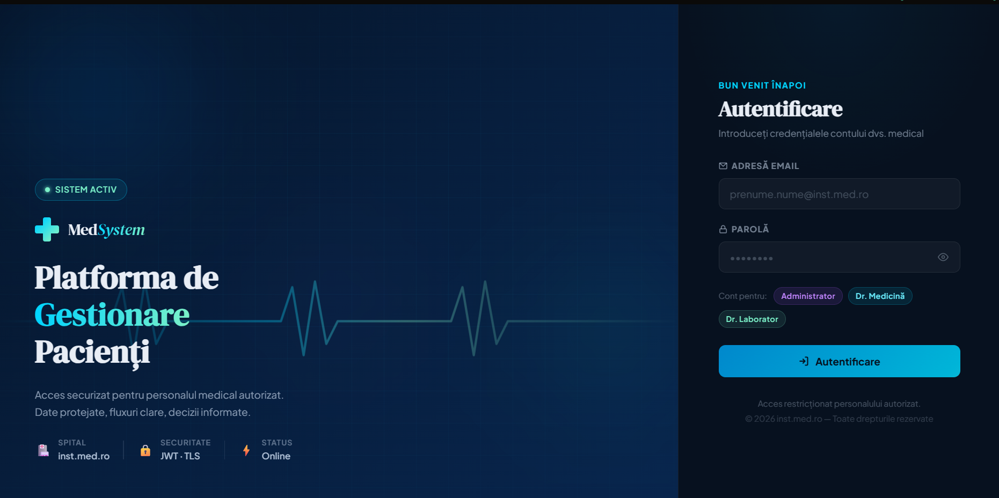
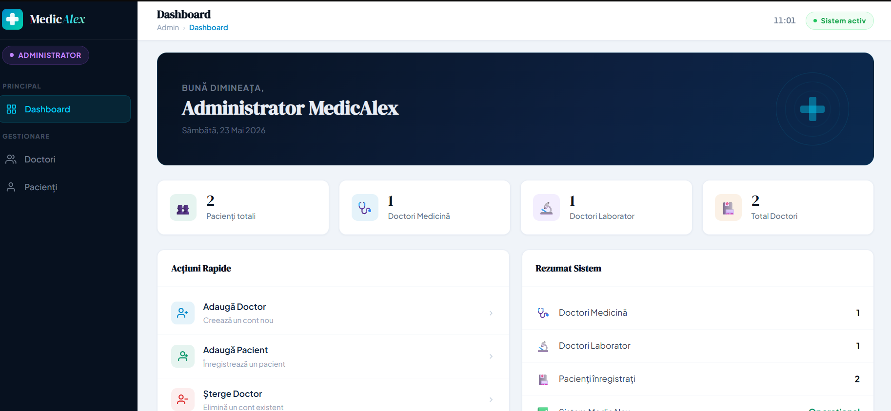
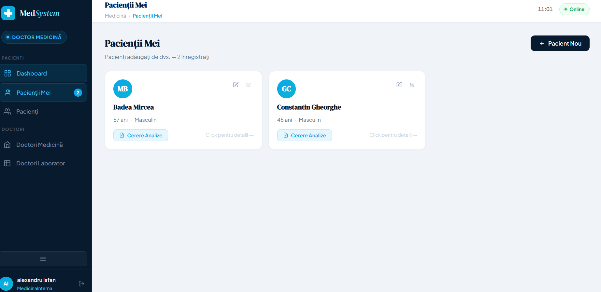
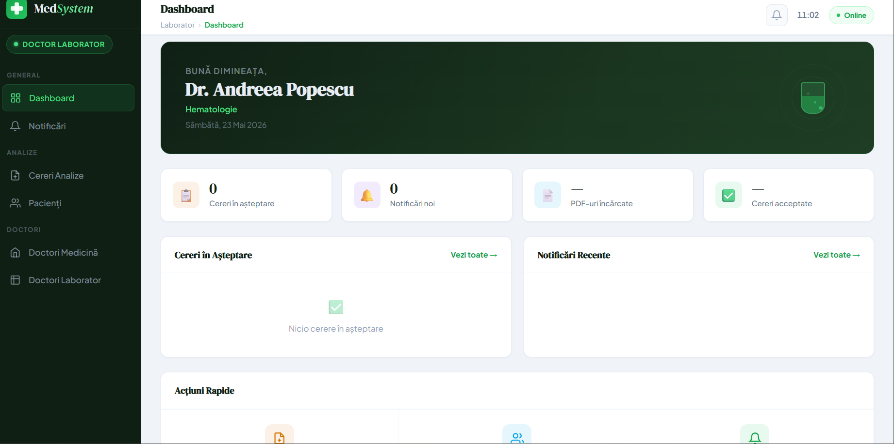

# README

## Login Page

Aplicația web oferă posibilitatea doctorilor de a accesa platforma printr-o pagină de autentificare securizată.

---

## Administrator

Administratorul are rolul principal de a gestiona întreaga platformă. Acesta poate:

- crea conturi pentru doctori, atât de tip medicină, cât și laborator
- adăuga pacienți în sistem
- șterge pacienți din sistem

Prin intermediul panoului de admin, se asigură organizarea și administrarea completă a utilizatorilor și pacienților.

---

## Doctor Medicină

Doctorul de tip medicină are acces extins asupra pacienților săi. Acesta poate:

- adăuga pacienți în sistem
- șterge pacienți
- introduce și actualiza informații medicale (nume, vârstă, date medicale și alte detalii relevante)
- vizualiza alți doctori, atât de tip medicină cât și laborator
- trimite cereri pentru efectuarea analizelor medicale

Acest rol este centrat pe gestionarea directă a pacienților și a istoricului lor medical.

---

## Doctor Laborator

Doctorul de laborator are un rol mai specializat și se ocupă strict de partea de analize medicale. Acesta poate:

- vizualiza detalii despre pacienți (fără a le putea modifica)
- răspunde la cererile de analize primite
- încărca rezultatele analizelor sub formă de fișier PDF

Acest rol este orientat exclusiv pe procesarea și furnizarea rezultatelor de laborator.

---

## Tehnologii folosite

Aplicația a fost dezvoltată folosind:
- Vue(Frontend)
- C#(Backend)
- PostgreSQL(Database)

---

## Proiect Academic
